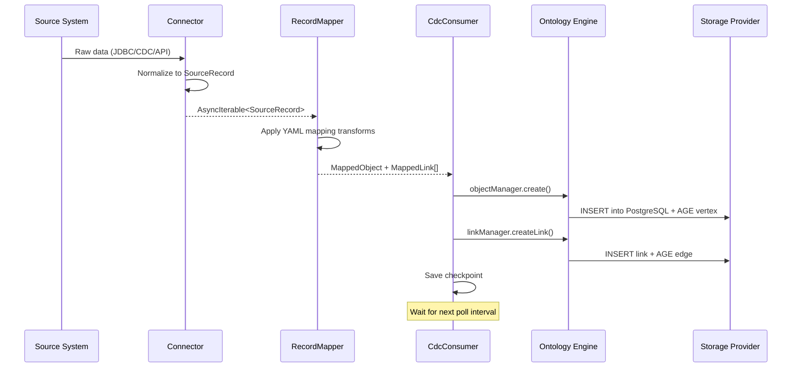

# Integration Flow — External Systems → Open Foundry

How external data sources connect to Open Foundry through connectors, mapping, and the change data capture pipeline.

## End-to-End Data Flow

## Connector Lifecycle

See [[connector-pattern]] for the full plugin architecture.

1. **Declaration** — YAML config in `domain-packs/*/connectors/*.yaml`
2. **Registration** — Plugin factory registered in `ConnectorRegistry`
3. **Instantiation** — `registry.create(type, config)` at server startup
4. **Initialization** — `connector.initialize()` — auth, connect, discover
5. **Extraction Loop** — Background `while(true)` calling `incrementalExtract()`
6. **Mapping** — `RecordMapper` applies YAML transforms to `SourceRecord`
7. **Consumption** — `CdcConsumer` feeds `MappedObject` → `ObjectManager`

## Sync Modes

| Mode | Behavior | Use Case |
|------|----------|----------|
| **CDC** | Live streaming with checkpointing. Data stored permanently in ontology. | Twitter/X feeds, Telegram channels |
| **OVERLAY** | Read-through cache, TTL-based. Data projected as ontology objects without permanent storage. | Reference data, ACLED conflict events |
| **POLLING** | Periodic pull at configurable interval. | RSS feeds, ISW assessments |
| **BATCH** | One-shot bulk import. | Initial historical backfill |

## Mapping Transforms

The `RecordMapper` applies transforms defined in YAML to convert source fields to ontology properties. Available transforms include `prefix()`, `suffix()`, `concat()`, `parseDate()`, `parseDateTime()`, `toUpper()`, `toLower()`, `trim()`, `ifPresent()`, `coalesce()`, `map()`, `parseInt()`, `parseFloat()`, and `custom()`. See [[cel-expressions]] for CEL-based transforms.

## Conflict Resolution

When source and ontology data diverge (e.g., duplicate records), the connector resolves via:
- **SOURCE_PRIORITY** — Source data wins
- **ACTION_PRIORITY** — User/action data wins

## Backpressure

Connectors support cooperative backpressure via `pause()` / `resume()` methods. Rate limiting is configured per connector (`maxRecordsPerSecond`).

## Connector Registry

Current connector plugins in [[sync-engine]]:

| Plugin | Type | Status |
|--------|------|--------|
| `jdbc` | PostgreSQL JDBC | Active — full implementation |
| `rest` | REST API | Stub — extraction TODO |
| `twitter` | X.com GraphQL API | Active — full implementation with browser cookie auth |

## Sources

- [Source: open-foundry-spec-v2.md Section 6] — Sync Engine specification
- [Source: open-foundry-spec-v2.md Section 6.1] — Connector interface
- [Source: open-foundry-spec-v2.md Section 6.2] — Extraction modes
- [Source: open-foundry-spec-v2.md Section 6.3] — Datasource mapping
- [Source: open-foundry-spec-v2.md Section 6.4] — Overlay mode
- [Source: open-foundry-spec-v2.md Section 6.5] — Transform functions
- [Source: open-foundry-spec-v2.md Section 6.6] — Conflict resolution
